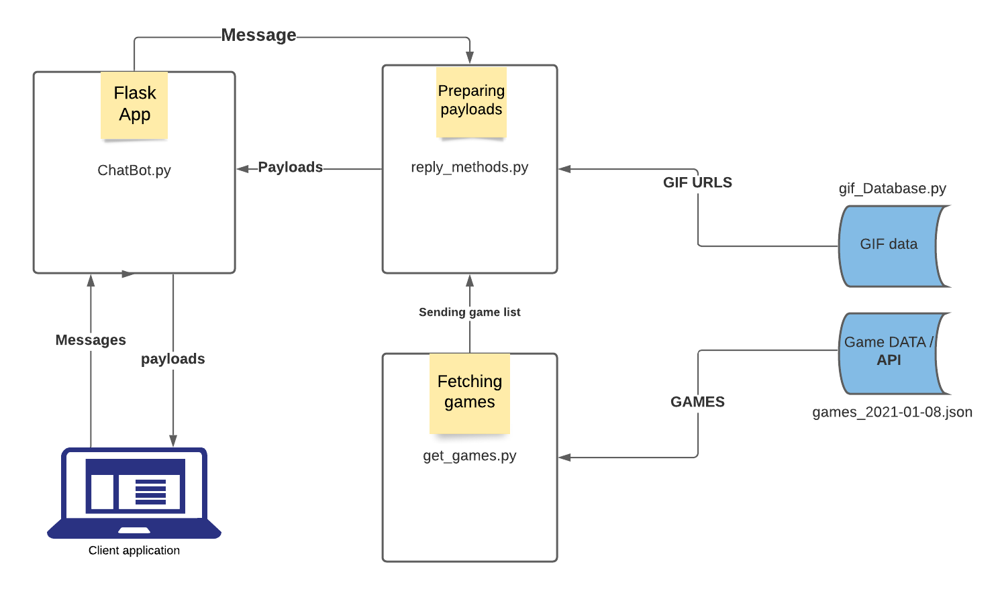

# game_Bot

## GameBot data flow


### Minimum Requirements
```bash
python #3.6 or higher version
```


# Get your FREE API Key through the Dev Portal
Get your FREE API Key @ https://portal.messengerx.io

### Install
```bash
# For Linux/MacOS
pip3 install machaa
pip3 install wit or pip3 install pywit

# For Windows
pip install machaao
pip install wit or pip install pywit
```

#### Clone basic gameBot from github
```bash
git clone https://github.com/machaao/gamebot.git
```

### Navigate to the newly created gamebot project directory
```bash
cd gamebot
```

### Open ```chatbot.py``` in any text editor, update the api key and base url as shown below
```bash
MESSENGERX_API_TOKEN = "<API_KEY_FROM_PORTAL>"
MESSENGERX_BASE_URL = "https://ganglia-dev.machaao.com" [for development purposes]

or

You can go with defalut setting.

```
### Setting up ```wit.ai server```
```
# Create your app at wit.ai and train it for you favourite intent
# navigate to setting of your bot and copy Server Access Token

client=wit("Server_Access_Token") # Copy Access token from wit.ai/app/<app_ID>/setting

or

You can go with default access token
```


### Run the following for machaao to do it's magic.
```bash
machaao run -t [GAMEBOT-TOKEN]
```

Your bot should now be available @ [https://dev.messengerx.io/<chatbot_name>] to send a message to your chatbot.

### Your gamebot is now ready to start receiving incoming messages from users
```bash
# HappyCoding
```

## Optional 

### Run Machaao Tunnel in a seperate terminal and note down your FORWARDING URL
```bash
machaao tunnel -p 5000 -t [GAMEBOT-TOKEN]

[https://<....>.tunnel.messengerx.io/]
```


### Go to your bot settings on the portal and update your Chatbot Webhook URL Settings
```bash
[https://<....>.tunnel.messengerx.io/machaao/incoming]
```

### Run your simple gamebot on your local server
```bash
# For Linux/MacOS
python3 chatbot.py

# For Windows
python chatbot.py
```
#### NOTE: UNDER ACTIVE DEVELOPMENT (ACCEPTING PULL REQUESTS)
### DEMO

